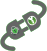

# keepassxc-cryptomator

Plug-in for Cryptomator to store vault passwords in KeePassXC

# Documentation
For documentation please take a look at the [Wiki](https://github.com/purejava/keepassxc-cryptomator/wiki).

# Donation
If you like this project, you can give me a cup of coffee :)

# Copyright
Copyright (C) 2021-2024 Ralph Plawetzki

The Cryptomator logo is Copyright (C) of https://cryptomator.org/

The KeePassXC logo is Copyright (C) of https://keepassxc.org/
